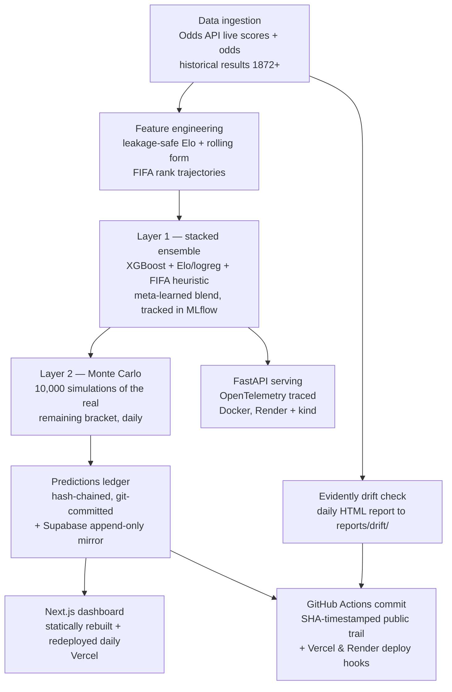

# WC26-MLOps — Verifiable Sports Prediction Platform

A fully autonomous ML pipeline that predicts World Cup 2026 outcomes daily, publishes every prediction to a **tamper-evident public ledger before kickoff**, and grades itself against the bookmaker market — it called Spain over France in the semifinal when the market said France, and you can [verify that claim yourself](#verifiable-prediction-history) without trusting a word of this README. It demonstrates end-to-end MLOps: scheduled cloud pipelines, experiment tracking and a model registry, drift monitoring, containerized serving with tracing, CI/CD, and a public dashboard that redeploys itself every day with zero human intervention.

[](https://github.com/dilipna/wc26-mlops/actions/workflows/daily_pipeline.yml)
[](https://github.com/dilipna/wc26-mlops/actions/workflows/ci.yml)


[](https://fifa2026mlops.vercel.app)

**Live dashboard: https://fifa2026mlops.vercel.app** · Serving API: https://wc26-serving.onrender.com/docs

## Architecture



The same sequence runs in two places on purpose: a **GitHub Actions workflow** (06:00 UTC daily — what actually keeps the site live with zero laptop dependency) and a **local Airflow DAG** (`docker-compose` or the kind cluster) as the demoable orchestration artifact.

## Verifiable Prediction History

The core claim of any prediction project — "we called it beforehand" — is usually unfalsifiable. Here it isn't:

- **Every prediction is committed to this repository's public history before the match starts.** The daily pipeline writes match predictions into [`dashboard/data/upcoming_matches.json`](dashboard/data/upcoming_matches.json) and commits; GitHub's SHA history timestamps it. The Spain-over-France semifinal call (model: Spain 40%, France 30% — market: France 40%) was public from commit [`89a1898`](https://github.com/dilipna/wc26-mlops/commit/89a1898ec378662cf3b5d56ae60453064bd3e823), three days before kickoff.
- **The ledger is hash-chained.** [`data/proof/prediction_ledger.json`](data/proof/prediction_ledger.json) covers every WC26 prediction; each entry embeds the SHA-256 of the previous one, so a quiet edit anywhere breaks every hash after it.
- **An append-only external mirror** (Supabase `match_predictions`, insert-only by schema) holds the raw timestamped snapshots the graded numbers come from.

### How to verify our predictions (3-step audit)

1. **Open any entry's provenance link** in [the ledger](data/proof/prediction_ledger.json) (or the "Verified Track Record" section of the live site) — it shows the prediction inside the committed file at a commit GitHub timestamped *before* kickoff. Compare the probabilities.
2. **Check the commit trail is machine-written**: the [Actions run history](https://github.com/dilipna/wc26-mlops/actions/workflows/daily_pipeline.yml) shows each daily commit produced by a scheduled public run — rewriting it would break every fork, clone, and the Actions log itself.
3. **Recompute the hash chain locally**: `python scripts/build_proof_ledger.py --verify` re-derives every hash from genesis and exits non-zero on any mismatch.

## Tech stack

| Tool | Version | Purpose |
|---|---|---|
| Python | 3.10 | pipeline, models, serving |
| XGBoost / scikit-learn | 3.2.0 / 1.4.1 | Layer 1 stacked ensemble (meta-learned blend) |
| MLflow | 3.2.0 | experiment tracking + model registry (a new version registered daily) |
| Airflow | 2.9.3 | local orchestration DAG (LocalExecutor) |
| GitHub Actions | — | CI + the scheduled cloud pipeline that keeps the site live |
| Evidently | 0.4.40 | daily feature-drift reports vs the training distribution |
| FastAPI + OpenTelemetry | 0.115 / 1.29 | serving API with request tracing (`/predict`, `/explain` with real SHAP, `/champions`) |
| Supabase (Postgres) | — | durable, append-only prediction snapshots |
| Docker / kind | — | containerized training/serving/orchestration; `make k8s-up` local cluster |
| Next.js + Tailwind + Recharts | 16 / 4 / 3 | the public dashboard, statically rebuilt daily |
| Vercel + Render | — | dashboard + serving API hosting, redeployed via deploy hooks |
| pytest | 8.1 | 60+ tests, gating every CI run and every daily pipeline run |

## Validation — backtested before trusted

Before touching live 2026 data, the exact two-layer pipeline was replayed against the 2018 and 2022 World Cups (full per-checkpoint data in [`data/backtest/`](data/backtest/)):

| Year | Champion | P(champion): post-group → post-R16 → post-QF → post-SF | Rising? |
|------|----------|---------------------------------------------------------|---------|
| 2018 | France | 0.061 → 0.128 → 0.306 → 0.622 | Yes |
| 2022 | Argentina | 0.216 → 0.211 → 0.495 → 0.650 | Yes |

Averaged across all checkpoints in both tournaments, the model beats the FIFA-ranking baseline on **Brier (−0.0035)** and **log-loss (−0.0987)** (negative = model better). Live 2026 performance — accuracy and Brier versus the bookmaker market, per match — is graded daily in the [ledger](data/proof/prediction_ledger.json) and on the [live site](https://fifa2026mlops.vercel.app/#proof).

## Setup from a clean clone

**Dashboard only (zero credentials, zero Docker) — the fastest path:**

```bash
git clone https://github.com/dilipna/wc26-mlops && cd wc26-mlops
cd dashboard && npm install && npm run dev   # http://localhost:3000, from committed data
```

**Python pipeline:**

```bash
pip install -r requirements-lock.txt          # exact transitive pins (resolved in python:3.10-slim)
python -m pytest tests/ -q                    # test suite
python scripts/export_dashboard_data.py       # regenerate dashboard JSON from committed logs
python scripts/daily_update.py                # full daily run -- needs ODDS_API_KEY in .env (see .env.example)
```

**Full backend stack (Airflow + MLflow + serving):**

```bash
make backend    # docker compose: Airflow http://localhost:8080 (admin/admin), MLflow :5000, API :8000
# or on Kubernetes (kind):
make k8s-up     # local kind cluster: Airflow :8081, MLflow :5001, API :8001
make k8s-down
```

Secrets go in `.env` (never committed) — copy [`.env.example`](.env.example). Without credentials, every external integration degrades gracefully: the dashboard builds from committed data, the pipeline skips ingestion with a clear message, MLflow/Supabase calls no-op.

## Repo map

```
data/proof/            hash-chained prediction ledger (the receipts)
data/predictions/      timestamped P(champion) log -- one row per team per day per series
reports/drift/         dated Evidently drift reports, committed daily
src/models/            layer1_ensemble (stacked) + layer2_simulation (Monte Carlo)
src/serving/           FastAPI + OpenTelemetry
src/verification/      prediction grading + ledger chain logic (unit-tested)
src/orchestration/     Airflow DAG
scripts/               every runnable entry point
dashboard/             Next.js site -- sports_config.json drives multi-sport nav
k8s/                   kind cluster manifests (make k8s-up)
DECISIONS.md           dated log of every non-trivial technical decision
PROJECT_BRAIN.md       cross-session working state + runbook
```
